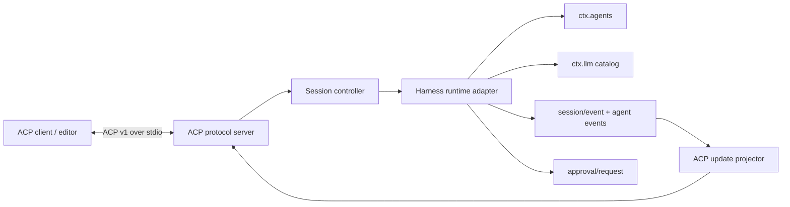

# DeepSeek Harness ACP Adapter Design

## Requirements

The package exposes DeepSeek Harness agents as a stable ACP v1 server over JSON-RPC stdio. It must preserve Harness ownership and lifecycle semantics while presenting the richer editor experience established by `claude-agent-acp` and `codex-acp`: selectable models, selectable reasoning effort, streamed assistant and thought text, visible tool calls and results, plans, permission requests, cancellation, and session metadata. The first release creates fresh in-memory sessions only. Persisted session listing, load, resume, fork, and deletion remain a later capability because they require a separate persistence contract and transcript replay policy.

The implementation targets Node.js 22 or newer, TypeScript in strict ESM mode, ACP protocol version 1, and `@agentclientprotocol/sdk` 1.3.x. It uses Harness public services and events instead of importing the concrete agent loop. Model catalogs are advisory, so the current configured route remains usable and visible even if it is absent from the provider catalog. Stdout is reserved exclusively for ACP frames; diagnostics use stderr or the Harness logger.

Non-functional requirements are deterministic event ordering, isolation between concurrent sessions, cancellation convergence, clean connection teardown, and no leaked secrets or internal session events. Unsupported ACP inputs fail with typed invalid-parameter errors. Client notification failures do not crash the Harness agent. Model changes apply at a Harness step boundary through `installModelSelection`, preventing prompt variables and request routing from observing different model selections.

## Architecture

The protocol server owns wire handlers and client callbacks but knows only a narrow runtime interface. The session controller owns ACP session records, one prompt slot per session, the mutable Harness `ModelSelectionRef`, and the exact agent disposer. The Harness runtime adapter creates agents with `ctx.agents.create`, installs model selection inside the unpublished agent setup, reads providers and models from `ctx.llm`, and subscribes to authoritative Harness events. This preserves the original adapter's bottom-layer usage without carrying forward its automation-only presentation policy.

The update projector is pure where possible. `assistant/chunk` text and reasoning deltas become ACP message and thought chunks. `tool/call` and `tool/result` become correlated tool cards, with invalid JSON arguments retained as raw text rather than crashing presentation. `todo/write` becomes an ACP plan snapshot. Committed usage and title facts become session metadata updates when the ACP schema supports them. Permission requests are offered as one-shot allow and reject options, matching the Harness approval waterfall.

The package exports both a Cordis plugin and protocol/runtime building blocks. Its `dsh-acp` executable boots a user-supplied Cordis configuration through Harness app boot, defaulting to `./cordis.yml`. A checked example configuration documents the complete runnable composition. This keeps deployment policy—provider credentials, sandbox, tools, persona, and persistence—outside the transport adapter.

## Error handling and lifecycle

Each ACP session record contains the exact Harness `AgentHandle`, current model selection, catalog snapshot, and at most one in-flight prompt. `session/prompt` validates content before reserving the slot, inserts a uniquely identified user message, correlates the claimed turn, and settles only after that owned activity reaches idle. A terminal Harness turn error rejects the ACP request; ACP cancellation resolves it with `cancelled`. Late events from a previous prompt cannot settle a newer slot because settlement checks both message and turn identity.

Connection close and Cordis disposal share a memoized teardown. Teardown first closes admission, then settles pending prompts, cancels running work, and disposes every owned handle. Event routing checks the exact session and agent object, not only the session id, preventing same-id impostors or unrelated frontends from crossing the adapter. Unknown cancellation ids are no-ops as required by ACP, while requests requiring a session fail clearly.

Model discovery failures are session-creation errors rather than silent empty selectors. A configured model missing from an advisory catalog is injected into its provider group. Changing a model rebuilds the reasoning selector from `resolveModelInfo`; if the previous effort is unsupported, the new model's default effort is selected. Changes during a running step affect the next step because Harness snapshots selection during prompt assembly.

Notification sends are serialized per session to preserve event order. A disconnected client closes the adapter; an isolated notification write failure is logged and contained until connection teardown begins. Parsing and wire validation are delegated to the ACP SDK. Values crossing from durable Harness events are projected defensively because logs and plugin-merged event vocabularies are durable boundaries.

## Verification

Unit tests cover model grouping, current out-of-catalog routes, reasoning-option replacement, prompt conversion, stop-reason mapping, tool projection, and malformed tool arguments. Protocol tests use the ACP SDK's in-memory streams to exercise initialize, new session, config changes, prompt streaming, cancellation, permissions, and teardown through actual JSON-RPC handlers. Harness integration tests mount the real Agent registry and loop testkit with a scripted LLM, proving that the adapter creates agents through `ctx.agents`, switches models through `installModelSelection`, and projects authoritative events without duplicate assistant text.

The release gate is `pnpm test`, `pnpm typecheck`, `pnpm lint`, and `pnpm build`. A CLI smoke test starts the built binary with a fixture Cordis configuration, initializes it through an SDK client, verifies that stdout remains valid NDJSON, and exits cleanly on EOF. The README includes Zed-compatible configuration, the supported ACP matrix, deployment composition, and the explicit phase-two limitations.
